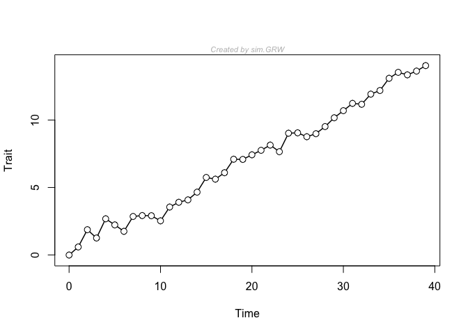

<!-- README.md is generated from README.Rmd. Please edit that file -->

# paleoTS

<!-- badges: start -->
<!-- badges: end -->

The goal of paleoTS is to allow the user to simulate and fit time-series
models commonly used to understand trait evolution in paleontology.
Models include random walks, stasis, directional trends, OU,
covariate-tracking, punctuations and more. Model fitting is done via
maximum likelihood.

## Example

This is a simple example in which a time-series is generated, plotted,
and then fit with three common models in paleobiology. The generating
model is a general (also called biased) random walk, with a pretty
strong trend parameter. Usually, this model receives just about all of
the available model support with these generating parameters.

``` r
library(paleoTS)
y <- sim.GRW(ns = 40, ms = 0.3)
plot(y)
```



``` r
fit3models(y)
#> 
#> Comparing 3 models [n = 40, method = Joint]
#> 
#>              logL K      AICc     dAICc Akaike.wt
#> GRW     -26.71456 3  60.09579   0.00000     0.998
#> URW     -34.09895 2  72.52223  12.42644     0.002
#> Stasis -106.97466 2 218.27365 158.17785     0.000
```

Take a look at the vignette “paleoTS_basics” for more of an introduction
to this package.

## Installation

paleoTS should be installed from CRAN.
